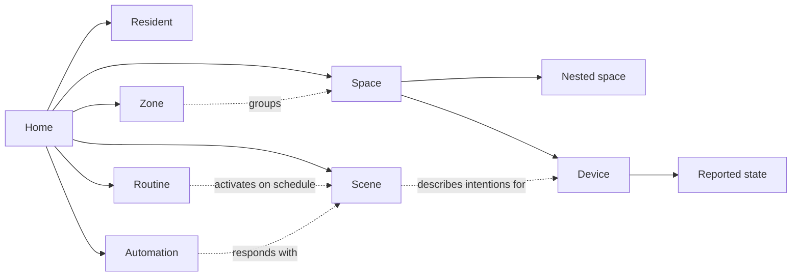

# Fluxzero Home

A home described the way you live in it: spaces, residents, lighting, comfort, music, gardens and daily habits. Fluxzero Home is a brand-independent example application on **Fluxzero SDK 2.0.0-rc.13**, with a working domain core, a responsive control interface and executable examples.

It can describe an apartment or an estate with several buildings, floors, gardens and outbuildings. Spaces can be nested freely. Zones such as *downstairs*, *outdoors* or *bedrooms* can overlap.



## What the core does

- **Homes and spaces:** names, local time zones, home modes, flexible layouts and moves within the same home.
- **Residents:** household roles and explicit presence. One resident leaving does not silently switch the entire home to away mode.
- **Devices:** capabilities for power, brightness, color, temperature, coverings, locks, media, volume, ventilation, irrigation and charging. A device can have several capabilities and measurements.
- **Scenes:** target one device, a space and its descendants, a zone or the entire home. All changes succeed together or none are applied.
- **Routines:** run once or on selected weekdays in the home's time zone. Pausing, resuming, rescheduling, cancellation and failure reasons are part of the model. Scheduled executions belong to their routine and are automatically cancelled when that routine or its home is deleted.
- **Automations:** react to a home mode or a measurement crossing a threshold, with a configurable cooldown between activations.
- **Reported state:** availability, actual settings and measurements remain separate from desired settings. Asking a door to lock does not mean it is already locked.

## Read the model

Start with [The home as a domain](docs/domain.md), then [Scenes and time](docs/scenes-and-time.md). [SDK 2.0 in this example](docs/sdk-2.md) connects the SDK capabilities to concrete code. The behavior tests under `src/test/java/io/fluxzero/home` are executable usage examples.

Descriptive data lives in dedicated values such as `HomeDetails`, `SpaceDetails` and `DeviceDetails`. Input constraints run before model and relationship checks. Creation and definition commands receive those values; a focused rename changes only the name. This example has not been deployed and uses the current schema without upcasters or explicit schema revisions. Start a fresh temporary runtime if a schema change makes old local example data incompatible.

`Home` and `Space` share the `Place` contract. A space has one parent: `new AddSpace(livingRoom, groundFloor, details)` or directly `new AddSpace(garden, home, details)`. `new MoveSpace(livingRoom, home)` moves it and its contents back under the home. The home relationship follows from the layout; a space does not store a second home ID.

`ReportDeviceStatus` receives one `deviceId`. It identifies the device and, with a separate prefix, the independent identity of its observations.

All models use plain `@Model`. Device observations retain history too, allowing automations to compare previous and new readings. Device searches and automations use relationships within a known home; the existing composition paths maintain the necessary internal documents. The [storage and search guide](docs/sdk-2.md#storage-and-search-in-this-home) explains these choices.

A comfortable evening looks like this:

```java
new DefineScene(evening, home, new SceneDetails("A pleasant evening"), List.of(
    new DimLights(new InSpace(livingRoom), new LightLevel(25)),
    new SetHeating(new InSpace(livingRoom), new RoomTemperature(new BigDecimal("21")))
));

new ActivateScene(evening);
```

The scene uses ordinary actions such as `DimLight` and `SetRoomTemperature`. Each concrete action contains its own small `@Apply`; the interfaces define contracts only. Routines and automations execute the scene and their progress together. A functional rejection is then recorded as a pause; a technical failure remains an error. Settings such as `LightLevel` carry their own input constraints. Scene activations remain in Model history even when the desired settings already match. No brand names, protocol fields or technical channel names are required.

Automations choose a concrete trigger such as `new HomeBecomes(HomeMode.AWAY)` or a sensor's `MeasurementCrosses`. Each trigger defines which change counts and checks its own conditions. `DefineAutomation` connects that trigger to a scene and a cooldown. The model stores the end of that cooldown; executions live in history without separate counters or audit timestamps.

Routines choose `new Once(moment)` or, for example, `new Weekly(Set.of(DayOfWeek.MONDAY), LocalTime.of(20, 0))`. Concrete timing patterns own their calendar rules; `RoutineTiming` defines only their contract.

## Run locally

Requirements: Git, the Fluxzero CLI, Java 25 and Node 22.12+. The repository includes the Maven Wrapper.

Start the development environment; Maven resolves the published SDK from Fluxzero Packages:

```bash
fz dev
```

Open the public URL printed by `fz dev`. Sign in through the local identity provider as **alex** (manage) or **sam** (view only). The environment starts the matching SDK runtime, backend, local IDP and Vite frontend dev server. React and CSS edits hot-reload without rebuilding Java. Initial frontend setup also checks the production bundle.

The [interface guide](docs/interface.md) covers controls, scenes, routines, authentication, API discovery and production setup. The [example commands](examples/README.md) populate a small home with no physical devices or credentials. Optional Home Assistant links use the operator's configuration.

For CI or an explicitly requested full verification, outside an active development environment:

```bash
(cd frontend && npm ci && npm run check)
./mvnw -B verify
```

The SDK is pinned to `2.0.0-rc.13`. Local development and CI use the same published version; no separate SDK checkout is required. `fluxzero.defaults.version=2026.09.10` enables the new defaults for Model conflicts and routing. The local tools version is configured separately in the build file.

## Phase 2

The first adapter connects [Home Assistant](docs/home-assistant.md): discover entities, explicitly link them to devices, control lights and switches, and read sensor measurements. Local commands and queries contain their own REST interaction through Fluxzero web requests, with auditable HTTP traffic and SDK retries. TestFixture web stubs replace Home Assistant in tests; no physical hardware is needed to run the example. The observation path uses Fluxzero scheduling for periodic snapshots.

[Matter and KNX](docs/standards.md) serve as references for device capabilities and complete home installations. Home Assistant is the first practical gateway. Direct brand adapters and a dedicated Matter controller have not been implemented.

[The integration boundary](docs/integration-boundary.md) describes where adapters belong, including acknowledgements, unknown capabilities and user identity. Core commands and queries serve trusted application components. The public interface enforces household-scoped `Account` permissions; a resident's household role does not grant API access.

To try real integration traffic without hardware, see the [local Home Assistant demo](dev/home-assistant/README.md). The optional `home-assistant` dev profile includes authenticated virtual devices; the normal `local` profile remains standalone.
