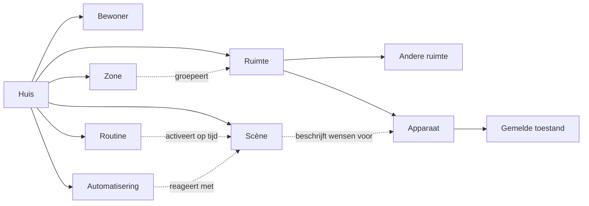

# Fluxzero Home

Een huis beschreven zoals je erin leeft: ruimtes, bewoners, licht, comfort, muziek, tuin en dagelijkse gewoontes. Fluxzero Home is een merkonafhankelijke voorbeeldapp op **Fluxzero SDK-commit `d88696f27d26`**, met een werkende domeinkern en uitvoerbare voorbeelden. De lokale kandidaat bouwt voort op rc.11.

Je kunt er een appartement mee beschrijven, maar ook een landgoed met meerdere gebouwen, verdiepingen, tuinen en bijgebouwen. Ruimtes mogen vrij worden genest. Zones zoals *beneden*, *buiten* of *de slaapvertrekken* kunnen elkaar overlappen.



## Wat de kern doet

- **Huis en ruimtes:** namen, lokale tijdzone, thuismodus, vrije indeling en verplaatsen binnen hetzelfde huis.
- **Bewoners:** huishoudrol en expliciete aanwezigheid. Het vertrek van één bewoner zet het huis niet ongemerkt op afwezig.
- **Apparaten:** mogelijkheden voor licht, kleur, temperatuur, zonwering, sloten, media, volume, ventilatie, irrigatie en laden. Een apparaat kan meerdere mogelijkheden én metingen hebben.
- **Scènes:** één apparaat, een hele ruimte met onderliggende ruimtes, een zone of het hele huis. Alle wijzigingen slagen samen of geen enkele wordt toegepast.
- **Routines:** eenmalig of op gekozen weekdagen, volgens de tijdzone van het huis. Pauzeren, hervatten, herplannen, annuleren en foutmeldingen behoren tot het model.
- **Automatiseringen:** reageren op een thuismodus of het overschrijden van een meetgrens, met een instelbare rustperiode tussen activaties.
- **Gemelde toestand:** bereikbaarheid, feitelijke instellingen en metingen blijven gescheiden van de gewenste instellingen. Een verzoek om een deur te vergrendelen betekent nog niet dat die deur vergrendeld is.

## Lees het model

Begin bij [Het huis als domein](docs/domein.md), daarna bij [Scènes en tijd](docs/scenes-en-tijd.md). [SDK 2.0 in dit voorbeeld](docs/sdk-2.md) koppelt de nieuwe SDK-mogelijkheden aan concrete code. De gedragstests onder `src/test/java/io/fluxzero/home` zijn uitvoerbare gebruiksvoorbeelden.

Beschrijvende gegevens zitten in eigen waarden zoals `HomeDetails`, `SpaceDetails` en `DeviceDetails`. Aanmaak- en definitiecommands ontvangen die waarden; een gerichte hernoeming verandert alleen de naam. Oude opgeslagen gegevens blijven leesbaar via versieconversie. Zie [bestaande opslag](docs/bestaande-opslag.md).

Alle modellen gebruiken gewone `@Model`. Ook apparaatwaarnemingen bewaren historie, zodat automatiseringen vorige en nieuwe metingen kunnen vergelijken. Apparaatzoeken en automatiseringen gebruiken de relaties binnen een bekend huis; daarvoor onderhouden de bestaande compositiepaden de benodigde interne documenten. De [uitleg over opslag en zoeken](docs/sdk-2.md#opslag-en-zoeken-in-dit-huis) maakt de keuzes concreet.

Een comfortabele avond is bijvoorbeeld:

```java
new DefineScene(evening, home, new SceneDetails("Een fijne avond"), List.of(
    new SceneAction(new SceneTarget.InSpace(livingRoom), new DeviceSetting.LightLevel(25)),
    new SceneAction(new SceneTarget.InSpace(livingRoom),
                    new DeviceSetting.Temperature(new BigDecimal("21")))
));

new ActivateScene(evening);
```

Onder dezelfde scène zitten gewone handelingen zoals `DimLight` en `SetRoomTemperature`. Er zijn geen merknamen, protocolvelden of technische kanaalnamen nodig.

## Lokaal gebruiken

Vereist: Git, de Fluxzero CLI en Java 25. De Maven Wrapper zit in de repository.

De kandidaat is nog niet gepubliceerd. Bouw eenmalig de vastgelegde SDK-commit vanuit de SDK-repository naast deze repo (of geef het pad als argument). Dit installeert een eigen lokale versie en laat de SDK-checkout en de gepubliceerde rc.11 intact:

```bash
scripts/prepare-sdk.sh
```

Start daarna de ontwikkelomgeving:

```bash
fz dev
```

De ontwikkelomgeving start de bijpassende lokale SDK-runtime, de app en de gerichte tests. Dit is een backendproject; er is nog geen dashboard of openbare HTTP-bedieningslaag. De app heeft geen API-sleutels nodig. De [voorbeeldcommando’s](examples/README.md) beschrijven een klein huis dat de ontwikkelomgeving kan laden.

Voor CI of een expliciet volledige controle, buiten een actieve ontwikkelomgeving:

```bash
./mvnw -B verify
```

De SDK staat vast op `2.0.0-rc.11-local.d88696f27d26`, gebouwd uit `d88696f27d26c03c29785c6fbf1c32cee270ae67`. Dit is geen officiële release. De CI-workflows bereiden dezelfde SDK voor; ze kunnen deze commit pas ophalen nadat hij in de SDK-repository is gepubliceerd. `fluxzero.defaults.version=2026.09.10` activeert de nieuwe defaults voor Model-conflicten en routing. De lokale tools-versie staat apart in het buildbestand.

## Fase 2

De kern registreert intenties en verwerkt waarnemingen. Fysieke aansturing volgt via API-adapters voor drie bekende home automation-systemen. De selectie wordt in fase 2 onderbouwd op bekendheid, beschikbare API's en dekking; er zijn nu nog geen leveranciers gekozen of geïntegreerd.

[De integratiegrens](docs/integratiegrens.md) beschrijft waar die adapters komen, inclusief bevestigingen, onbekende apparaatmogelijkheden en de identiteit van de gebruiker. De huidige commands en queries zijn voor vertrouwde applicatiecomponenten; de huishoudrol is domeininformatie en vormt nog geen toegangscontrole voor een openbare API.
