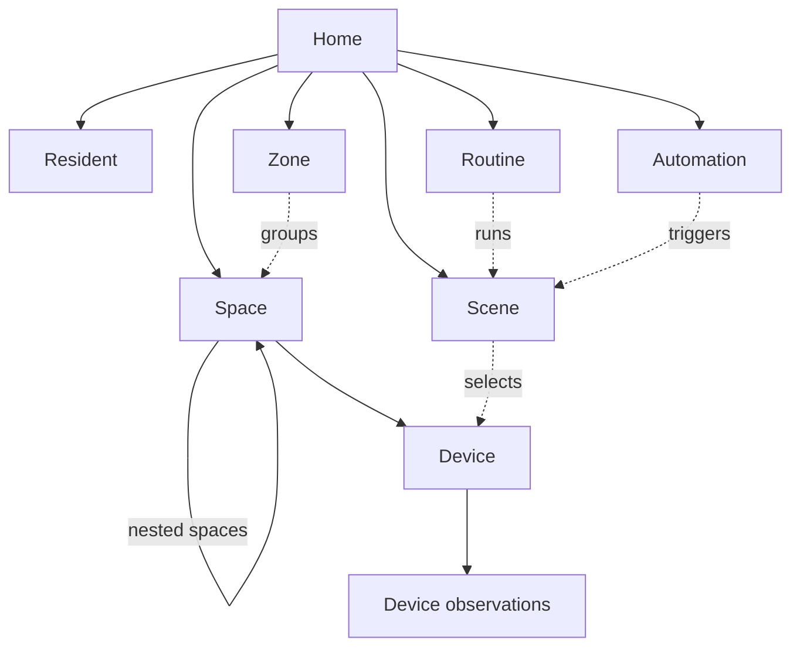
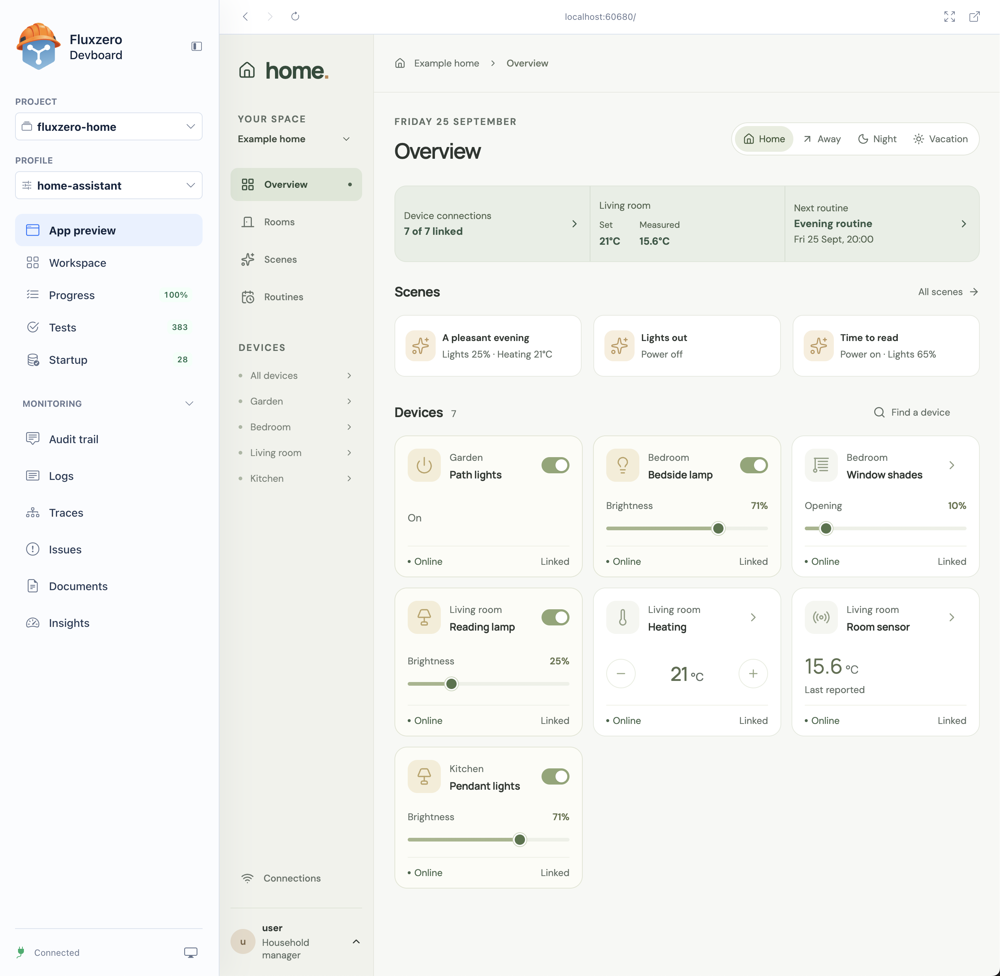

# Fluxzero Home

**A home that listens.**

[](https://github.com/fluxzero-io/fluxzero-sample-home/actions/workflows/verify.yml)
[](LICENSE)

A working home automation example built with **Fluxzero Java SDK 2.0.0**.
Arrange rooms, control devices, compose scenes and plan daily routines through a
React interface, with a real Home Assistant integration for connected equipment.

The example starts with familiar household rules. A scene changes its requests
together, a paused routine must not run, and a physical light switch remains useful
after someone has used the app. Fluxzero provides Models, relationships, history,
message handling and scheduling; Home expresses what those capabilities mean for
the people living there.


## The product model

A home contains places: floors, rooms and outdoor spaces. Devices belong to those
places and describe what they can do or measure. A scene combines actions; a
routine runs a scene at a chosen time, while an automation reacts to a change such
as leaving home or a temperature crossing a threshold. Zones group spaces without
moving them.

These are Fluxzero **Models**: objects with their own identity and lifecycle.
Their relationships form the **model graph**. A lamp can be replaced without
rewriting a room's history, and a routine can be removed while keeping its scene.



Solid arrows run from parent to child: each child has its own lifecycle within
that relationship. Dotted arrows are references, without ownership. A scene used
by a routine or automation cannot be removed until those references are changed.
The [domain guide](docs/domain.md) explains the household model; the
[integration graph](docs/integration-boundary.md#connection-and-access-models)
shows connection and account relationships.

Device requests and observations have different jobs. Home requests “turn on”; an
adapter later reports what happened. Once confirmed, that request is finished.
If someone then turns the light off at the wall, Home follows the new observation
instead of restoring an old setting.

## What is built

| Feature | Behavior in this app |
| --- | --- |
| Rooms and devices | Create rooms in the UI, browse devices by room and control lighting, heating, shades and other capabilities. Nested spaces, zones and residents are modeled in the core. |
| Scenes | Compose actions for one device, a space, a zone or the whole home. The selected requests are accepted together or none are applied. |
| Routines | One-off and weekly schedules, with pause, resume, replanning and the home's timezone. |
| Automations | React to home-mode changes or sensor threshold crossings, with cooldowns and readable pause reasons. Defined through commands; there is no automation editor yet. |
| Observations | Show measured state, outstanding requests and connection problems; follow physical controls after a request completes. |
| Home Assistant | Authenticated discovery, device linking, service calls, observation polling and recovery. An optional local profile links seven virtual devices. |
| Household access | Separate viewing, control and management permissions, with local demo sign-in and live browser updates. |

## Try it locally

Start with **[Fluxzero Get started](https://fluxzero.io/get-started)** to set up Fluxzero in your coding agent. Then ask your agent:

> Clone https://github.com/fluxzero-io/fluxzero-sample-home and run this existing example locally. Follow its AGENTS.md and use the Fluxzero plugin to start the development environment.

No Fluxzero account, API token or Home Assistant installation is required for this first run.

<details>
<summary>Alternative: install and run with the CLI</summary>

Install [the Fluxzero CLI](https://github.com/fluxzero-io/fluxzero-cli#installation), **Java 25**, **Node.js 22.12+** and Git. The repository includes the Maven Wrapper.

```sh
git clone https://github.com/fluxzero-io/fluxzero-sample-home.git
cd fluxzero-sample-home
fz dev
```

</details>

Open the local URL shown by your agent or the CLI and sign in through the local identity provider with any username. New local demo users automatically receive management access to the example home. The preconfigured **alex** is also a manager; **sam** keeps read-only access for trying that role.

The environment starts the matching SDK runtime, backend, identity provider and **Vite dev server**, and populates an example home. React and CSS edits hot-reload; Java changes use the managed compile and test loop. The first start downloads dependencies and checks the frontend production build.

Stop the environment with `fz dev stop`. Its Fluxzero runtime is temporary: a new environment starts from the example commands again.

### Explore with Devboard

In your coding agent, use the Fluxzero plugin command:

```text
/fluxzero:devboard
```

Devboard brings the development environment together in one place:

- **App preview:** use Home directly inside Devboard, with live updates while you develop.
- **Tests:** inspect test results and failures from the managed development loop.
- **Progress and Startup:** follow recorded feature progress and inspect startup actions.
- **Monitoring:** explore the audit trail, logs, traces and documents.

Use the **Profile** selector to switch between `local` and `home-assistant`. Switching restarts the environment with the selected configuration; the Home Assistant profile requires the [setup described below](#try-the-real-home-assistant-api).



*The optional Home Assistant profile connects all seven devices to virtual equipment through the real API.*

### Explore the home

1. **Make room.** Open **Rooms → New room**, name it **Study** and choose its location.
   It appears in Rooms and the device navigation immediately. No integration is needed;
   the new room is empty until devices are added through commands.
2. **Set the scene.** Change Reading lamp brightness to 60%, then activate
   **A pleasant evening**. Home requests 25% brightness and a 21 °C heating setting
   together. In `local`, these are saved requests: devices stay **Not linked** and
   **No report**. Brightness does not implicitly turn a light on.
3. **Plan ahead.** In **Routines**, create a **Once** routine for **Lights out** a few
   minutes in the future. Pause it and check that the next execution disappears;
   resume before its deadline and let it run. Try a **Weekly** routine to see the
   home's timezone and repeat days. Removing a routine also removes its scheduled work.

To try read-only access, sign out through the bottom-left account menu and sign
back in as **sam**. You can view the home but cannot change its settings.

### Try the real Home Assistant API

With Docker running a Linux container engine and Python 3 installed, switch to the optional profile:

```sh
fz dev restart --profile home-assistant
```

For a first start, use `fz dev --profile home-assistant`. This runs the official Home Assistant Demo integration, creates private local credentials and links all seven devices. It uses real bearer authentication and REST requests, with virtual lights, heating, shades and sensors.

**[Test the integration step by step →](docs/testing-home-assistant.md)**

The guide covers authenticated and rejected requests, device control, changes made directly in Home Assistant, connection loss and recovery. It includes a workflow for coding agents. [Demo setup and lifecycle](dev/home-assistant/README.md) describes the container, credentials and reset behavior.

## How the rules become an application

Take **“Dim the living room lights to 25% and set heating to 21 °C.”** Home stores
those actions as a scene. `ActivateScene` selects suitable devices from the home
graph and produces ordinary commands such as `DimLight` and `SetRoomTemperature`.
Fluxzero checks and commits them together with the scene activation. A rejected
action leaves none of that scene's device requests applied.

Physical delivery follows the commit. The Home Assistant adapter sends service
requests through Fluxzero and separately reads observations. An HTTP success does
not mean the equipment has reached the requested setting. This distinction keeps
a disconnected light from appearing confirmed and lets another controller change
it later. See [the integration boundary](docs/integration-boundary.md).

A routine adds a timing rule and a next execution. Home defines the calendar
behavior, pause rules and response when a scene can no longer run; Fluxzero stores
the scheduled command and cancels owned work when the routine is deleted. Read
[scenes and time](docs/scenes-and-time.md) for clock changes, cooldowns and failure
handling.

## What the scenarios demonstrate

| Situation | What the existing tests check |
| --- | --- |
| A scene contains an invalid or missing target | No device is left with a partially applied scene. |
| Someone uses another controller after Home | The new observation leads the UI; a completed request is not sent again. |
| A routine is paused, replanned or removed | Old scheduled work cannot execute the previous intention. |
| A weekly time falls in a daylight-saving transition | A nonexistent time is skipped; a repeated time runs only at its first occurrence. |
| Temperature stays above a threshold | A new reading on the same side does not count as another crossing; cooldown still applies. |
| Home Assistant is unavailable or refuses a request | Pending requests and connection problems remain separate from observations; recovery uses current intent. |
| A viewer tries to control equipment or access another home | The HTTP boundary refuses the action. |

The [verification guide](docs/development.md#verification) links these rules to
existing tests. It distinguishes fixture scenarios, the real Home Assistant demo
and checks that still belong to a production deployment.

## Extend it with your agent

Describe the household behavior you want. For example:

- “Let each account pin favorite scenes on its overview.”
- “Build an editor for the existing sensor-triggered automations.”
- “Let a manager move a device to another room from the UI, using the existing domain command.”

These extensions are not implemented yet. Ask your agent to identify the owning
Models, demonstrate the rules with scenarios and then add the screens. Include
what should happen when equipment is unreachable, another controller changes a
setting or a routine is paused before its deadline.

## Local defaults and optional setup

| Area | Included | Additional setup or work |
| --- | --- | --- |
| Equipment | Capability-based controls and a seven-device example | The default `local` profile saves requests without controlling equipment. Use the Home Assistant profile for real API calls to virtual devices. |
| Home Assistant | Demo bootstrap, private credentials, fixture tests and a real API walkthrough | An accessible installation and server-side credentials for your own equipment; device linking currently uses commands. |
| Household setup | Room creation and device browsing in the UI | Device provisioning, layout changes, zones, residents and automation definitions remain command-driven. |
| Other systems | Provider-independent device and scene commands | Direct Matter and KNX adapters are not included. The HA adapter supports lights, switches, temperature setpoints, covers and sensor observations. |
| Deployment | Household authorization and a manual cloud deployment workflow | Your own identity configuration, account provisioning, runtime, operational checks and physical-device qualification. |

## Develop and verify

Read the [development guide](docs/development.md) for the source layout, a code
tour, demo lifecycle and links from product rules to tests. It also documents clean
CI verification outside an active managed environment. Use the
[interface guide](docs/interface.md) for HTTP endpoints, live updates and access
control, and [SDK 2.0 in this example](docs/sdk-2.md) for the modeling choices.
The [example commands](examples/README.md) are another executable entry point.

## Versions and license

The current checkout uses the published **Fluxzero SDK 2.0.0**, pinned in `pom.xml`.
It needs no SDK checkout or locally installed candidate artifacts. This is an
executable example, with no production deployment or schema-migration guarantee.
See the [release tags](https://github.com/fluxzero-io/fluxzero-sample-home/releases)
for reproducible source snapshots.

Licensed under [Apache-2.0](LICENSE). The house illustration and interface are
original; the Fluxzero logo identifies the platform. Home Assistant is a separate
project and this example is not affiliated with it.
