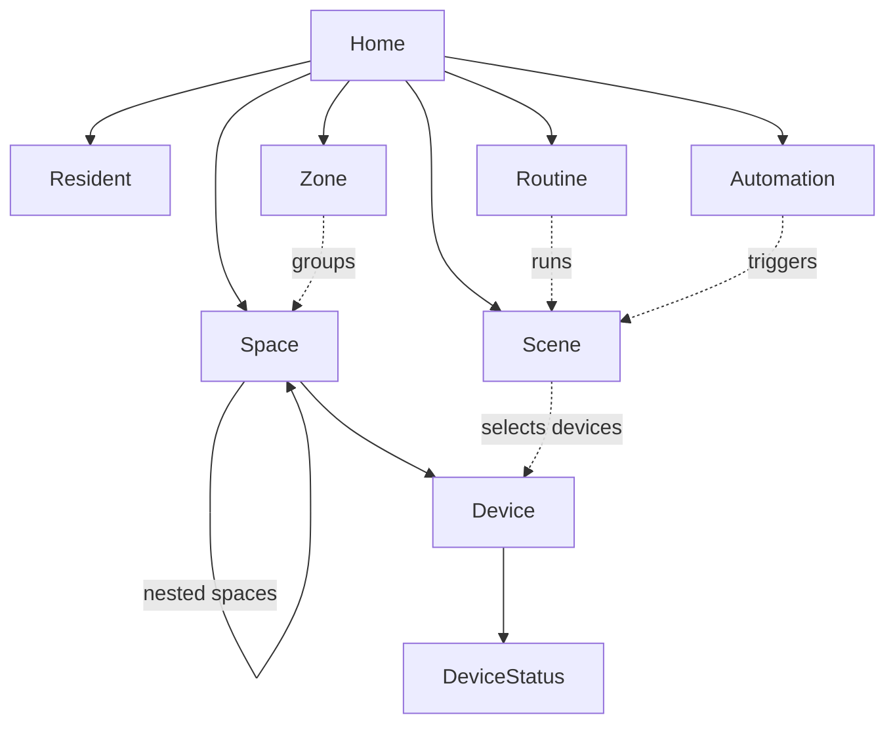
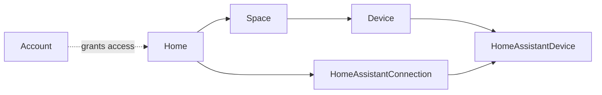

# Fluxzero Home

**A home that listens.**

[](https://github.com/fluxzero-io/fluxzero-sample-home/actions/workflows/verify.yml)
[](LICENSE)

An example application for **Fluxzero 2.0**: model a home, control its devices, compose scenes and schedule daily routines. A brand-independent Java domain connects to a React interface and a working Home Assistant integration.


*The optional Home Assistant demo links all seven devices to authenticated virtual equipment. No physical hardware is needed.*

## Try it locally

Start with **[Fluxzero Get started](https://fluxzero.io/get-started)** to set up Fluxzero in your coding agent. Then ask your agent:

> Clone https://github.com/fluxzero-io/fluxzero-sample-home and run this existing example locally. Follow its AGENTS.md and use the Fluxzero plugin to start the development environment.

No Fluxzero account, API token or Home Assistant installation is required for this first run.

<details>
<summary>Alternative: install and run with the CLI</summary>

Install [the Fluxzero CLI](https://github.com/fluxzero-io/fluxzero-cli#installation), **Java 25**, **Node.js 22.12+** and Git. The repository includes the Maven Wrapper.

```sh
git clone https://github.com/fluxzero-io/fluxzero-sample-home.git
cd fluxzero-sample-home
fz dev
```

</details>

Open the local URL shown by your agent or the CLI. Sign in through the local identity provider as **alex** to manage the home, or **sam** for read-only access.

The environment starts the matching SDK runtime, backend, identity provider and **Vite dev server**, and populates an example home. React and CSS edits hot-reload; Java changes use the managed compile and test loop. The first start downloads dependencies and checks the frontend production build.

Try creating a room, changing a light, activating **A pleasant evening**, and planning a routine. In this default profile, device settings are saved without sending them to equipment; devices remain **Not linked**. Rooms are part of Home and can be created independently of any integration.

Stop the environment with `fz dev stop`. Its Fluxzero runtime is temporary: a new environment starts from the example commands again.

### Try the real Home Assistant API

With Docker running a Linux container engine and Python 3 installed, switch to the optional profile:

```sh
fz dev restart --profile home-assistant
```

For a first start, use `fz dev --profile home-assistant`. This runs the official Home Assistant Demo integration, creates private local credentials and links all seven devices. It uses real bearer authentication and REST requests, with virtual lights, heating, shades and sensors.

**[Test the integration step by step →](docs/testing-home-assistant.md)**

The guide covers authenticated and rejected requests, device control, independent state observations, connection loss and recovery. It includes a workflow for coding agents. [Demo setup and lifecycle](dev/home-assistant/README.md) describes the container, credentials and reset behavior.

## What to explore

- **A flexible home:** buildings, floors, nested rooms, gardens, overlapping zones, residents and home modes.
- **Recognizable intentions:** turn on a light, set a temperature, open the shades. Settings and observations remain distinct.
- **Scenes:** target a device, space, zone or entire home. The domain commits all scene intentions together.
- **Routines and automations:** one-off or weekly schedules in the home's timezone, threshold crossings, cooldowns and meaningful pause states.
- **Everyday controls:** room creation, live device views, scene editing, routine management and household-scoped permissions.
- **An external API:** Home Assistant interactions use Fluxzero commands, queries and the web gateway, with fixture tests and a real local demo.

Atomic scene changes apply to Home's intentions; physical devices are controlled after commit and confirm independently. The core also models locks, media, ventilation, irrigation and charging. The current Home Assistant adapter supports lights, switches, temperature setpoints, covers and sensor observations. Device provisioning and automation definitions are currently command-driven. Direct Matter and KNX adapters are not included.

## The model graph

Each box is an independent `@Model` with its own identity and history. Solid arrows run **from parent to child** (`@Parent`); dotted arrows show key references or selections without ownership.



A space belongs to either the home or another space. Zones group spaces without owning them. Scenes select devices directly or through a space, zone or the whole home. `Device` stores desired settings; `DeviceStatus` has its own observation history. Routine and automation references do not make a scene their parent: removing a scene is refused while they still use it.

<details>
<summary>Integration and access models</summary>



A `HomeAssistantDevice` link has two parents: the Home device and its Home Assistant connection. Deleting either parent removes the link; deleting a connection leaves the Home device intact. `Account` references the homes it grants access to and has a separate lifecycle from `Resident`.

</details>

See the [domain guide](docs/domain.md) for lifecycle rules and the [integration boundary](docs/integration-boundary.md) for external delivery.

## A short code tour

| Start here | What it demonstrates |
| --- | --- |
| [AddSpace](src/main/java/io/fluxzero/home/command/AddSpace.java) and [Space](src/main/java/io/fluxzero/home/model/Space.java) | Typed identities, cohesive details, independent Models and recursive `@Parent` relationships. |
| [FindDevices](src/main/java/io/fluxzero/home/query/FindDevices.java) | Search within a known home's relationships, without projecting every home. |
| [ActivateScene](src/main/java/io/fluxzero/home/command/ActivateScene.java) | Ordinary device commands combined into one atomic Model commit. |
| [RunRoutine](src/main/java/io/fluxzero/home/automation/RunRoutine.java) and [RoutineSchedules](src/main/java/io/fluxzero/home/automation/RoutineSchedules.java) | Owned schedules, current Graph reconciliation and functional workflow outcomes. |
| [DeviceStatus](src/main/java/io/fluxzero/home/model/DeviceStatus.java) | A separate observation lifecycle, sharing one input ID with its device parent. |
| [CallHomeAssistantService](src/main/java/io/fluxzero/home/homeassistant/CallHomeAssistantService.java) | A local message handler making an auditable external web request. |
| [SceneBehaviorTest](src/test/java/io/fluxzero/home/SceneBehaviorTest.java) and [HomeAssistantRequestTest](src/test/java/io/fluxzero/home/homeassistant/HomeAssistantRequestTest.java) | Product behavior and API contracts through Fluxzero's `TestFixture`. |

Read [SDK 2.0 in this example](docs/sdk-2.md) for the modeling and execution choices, then the [domain guide](docs/domain.md), [scenes and time](docs/scenes-and-time.md), [interface guide](docs/interface.md) and [Home Assistant adapter](docs/home-assistant.md). The [example commands](examples/README.md) are another executable entry point.

## Develop and verify

Use `fz dev` for the development loop. Coding agents should read [AGENTS.md](AGENTS.md) and follow [Fluxzero Get started](https://fluxzero.io/get-started) to set up the plugin for version-matched SDK guidance and managed build/test feedback.

CI performs a clean frontend check and full backend verification without Docker, a Fluxzero account or repository secrets. Outside an active dev environment, the equivalent commands are:

```sh
(cd frontend && npm ci && npm run check)
./mvnw -B verify
```

The [Verify workflow](.github/workflows/verify.yml) runs on pushes and pull requests. The separate [cloud deployment workflow](.github/workflows/deploy-to-fluxzero-cloud.yml) is manual and requires an operator's cloud and identity configuration; see [production setup](docs/interface.md#identity-and-permissions).

## Versions and license

App release **0.1.0** uses the published **Fluxzero SDK 2.0.0-rc.13**, pinned in `pom.xml`. It needs no SDK checkout or locally installed candidate artifacts. SDK 2.0 is still a release candidate; this app is an executable example, with no production deployment or schema-migration guarantee. See the [release tags](https://github.com/fluxzero-io/fluxzero-sample-home/releases) for reproducible source snapshots.

Licensed under [Apache-2.0](LICENSE). The house illustration and interface are original; the Fluxzero logo identifies the platform. Home Assistant is a separate project and this example is not affiliated with it.
